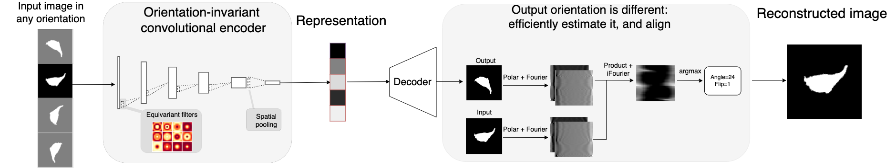

# O2VAE - orientation invariant morphologic profiling for cells and organelles

This repo contains code and demos for our paper ["Learning orientation-invariant representations enables accurate and robust morphologic profiling of cells and organelles"](https://biorxiv.org/). 

## Contents
- [Background and Method](#method)
- [What's in this repo](#contents)
- [Usage - learning representations](#usage1)
- [Usage - using representation for analysis](#usage2)
- [Citation](#citation)

## <a name="method"/> Background and method
In morphologic profiling for cell biology, we want to map image of centered cells or organelles to a vector of numbers (a profile/representation/embeddings/features). We then use those vectors for analyses like clustering, classification, outlier detection, dimensionality reduction, and visualization. 


If we naively apply unsupervised learning methods like PCA or autoencoders, then rotating the image changes the representation vector. 


Our representation learning method, O2-VAE, forces the embeddings to be the same under any rotation or flip (this is the group of orthogonal transforms, called O(2)):


Orientation invariance improves downstream anaylses. For example, we cluster representation spaces that were learned with enforced orientation invariance (left) and without enforced orientation invariance (right). Clusters from O2-invariant representations are based on shape, but clusters from non-invariant representations are sometimes based on orientation as well. 


The O2-VAE is a deep autoencoder that is trained to compress the image to a vector and then to reconstruct it. After training, the compressed vector is used as the morphologic profile. 



## <a name="contents"> What's in this repo
**Learning representations: O2-VAE model and training methods**
Code for defining and training the O2-VAE model based on PyTorch (see [usage - learning](#usage1)).  Orientation invariance is enforced by the model arhcitecure, using the [e2cnn](https://github.com/QUVA-Lab/e2cnn/) library. 

**Using representations: analysis and visualization tools for cell biology profiling**
Notebooks demonstrating example analyses (see [this section](#usage2)). Extracting learned representations from a pretrained model and examples of clustering, outlier detection, classficiation, dimensionality reduction, and visualization. 

**Efficient image registration: module for rotation and flip image alginment on GPUs**  
The O2-VAE loss function requires finding the rotation and flip that best aligns two images, and [Reddy et al](https://ieeexplore.ieee.org/abstract/document/506761) propose an efficient Fourier-based method. We provide an implementation that takes advantage of efficient batch processing on GPUs, which may be useful for other computer vision applications (see `./registration/` and its [guide](./registration/README.md))

**Prealignment methods** 
For very simple datasets (e.g. nuclei segmentation masks) a preprocessing method, 'prealignment', may be enough to control for orientation sensitivty. For users who want to try this approach before using O2vae, We provide some basic functions (see `./prealignment/` and its [guide](./prealignment/README.md)).


## <a name="usage1"/> Usage - learning representations 
### Dependencies 
```
  pip install -r requirements.txt
```
The model training is much faster with access to GPUs, which can be accessed freely using [Colab](https://research.google.com/colaboratory/faq.html). If using them, check [pytorch](https://pytorch.org/) to install the correct torch and cuda versions. 

### Configuration
`./configs/` has example config files. See the  file's comments for more about changing default data locations, model architecture, loss functions, and logging parameters.

### Datasets 
The scripts will search a directory (defined in config file `config.data.data_dir`) for datasets. It must have at least `X_train.sav`, which should be a numpy array or torch Tensor containing images of centered objects. The array shape is `(n_samples,n_channels,height,width)`. Optionally, you can have test data, `X_test.sav` for validation during training. You can also provide labels `y_train.sav` and `y_test.sav`.

We provide two demo datasets, [o2-mnist](./data/o2_mnist/README.md) and [MEFS](./data/mefs/README.md). To get these datasets run:
```
bash data/generate_o2mnist.py
bash data/mefs/unzip_mefs.bash
```

### Logging and saving models
We use [weights and biases](https://wandb.ai/) to handle logging. Each run will create a new folder inside `wandb/<run_name>` containing the saved model in `wandb/<run_name>/files/model.pt` (printed to screen after running). 

[optional] To access the wandb dashboard with training metrics, log in to a weights and biases account and set the config file to:  
```
config.wandb_log_settings.wandb_anonymous=False` 
config.wandb_log_settings.wandb_enbable_cloud_logging=True`
```

### Scripts 
To train an o2-vae model, edit `./run.bash` to point to the right config file, and run:
```
bash run.bash
```
**Important** check the terminal for the location of the saved models. Something like:
> Logging directory is `wandb/<log_dir>`


### Running in a notebook
Examples notebooks for training models are in `notebooks/`. This is mostly the same code as `run.py` but without any logging. 

## <a name="usage2"/> Usage - using representation for analysis  
### Recovering trained models 
Take the same model config file, `configs/<mu_config>`, and get saved model location, `fname_model=wandb/<run_name>/files_model.pt`. Then you can recover the model with:

```
import run
import torch

from configs.<my_config> import config
model=run.get_datasets_from_config(config)

fname_model=wandb/<run_name>/files_model.pt`
saved_model=torch.load(fname_model)
model.load_state_dict(saved_model['state_dict'])
```

### Extracting learned features / representations
Load the dataset from the config information and extract features:

```
import run 
import utils
from configs.<my_config> import config

dset, loader, dset_test, loader_test = run.get_datasets_from_config(config)

embeddings, labels = utils.get_model_embeddings_from_loader(model, loader, return_labels=True)
embeddings_test, labels_test = utils.get_model_embeddings_from_loader(model, loader_test, return_labels=True)
```
Note that downstream analysis only needs the representations; you do not need access to the model. 

### Anlaysis 
See `examples/` for notebooks with example analysis, which use functions in `analysis/`.

## <a name="citation"/> Citation
If this repo contributed to your research, please consider citing our paper:
```
@article{burgess2023orientation,
  title={},
  author={},
  journal={biorxiv},
  pages={},
  year={2023},
  publisher={}
}
```

