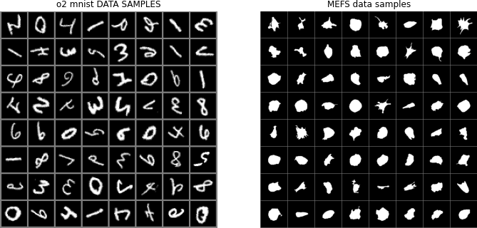

# Demo datasets
This repo contains two demo datasets, o2-mnist and the MEFs.



## O2-mnist
This is a modified version of the classic MNIST dataset, but with random flips and rotations applied. 
To generate run: 
```
python data/generate_o2mnist.py
```
See its [README](./o2_mnist/README.md) for more.

## MEFs
This dataset was producted for [A robust unsupervised machine-learning method to quantify the morphological heterogeneity of cells and nuclei](https://www.nature.com/articles/s41596-020-00432-x). The data in this repo is the result of post-processing, object extraction, and object centering, so that each image

In the home-directory, run:
```
bash data/generate_o2mnist.py
```

See its [README](./mefs/README.md) for more.

The full (non-preprocessed) MEFs segmentations and the segmentation pipeline is available at zenodo link: <todo>. See the original paper for location of original (non-segmented) data.

# Other datasets from the paper 
The simulated cell dataset is available at zenodo link: <todo>


For access to the hIPSC 

For public datasets, refer to the 

