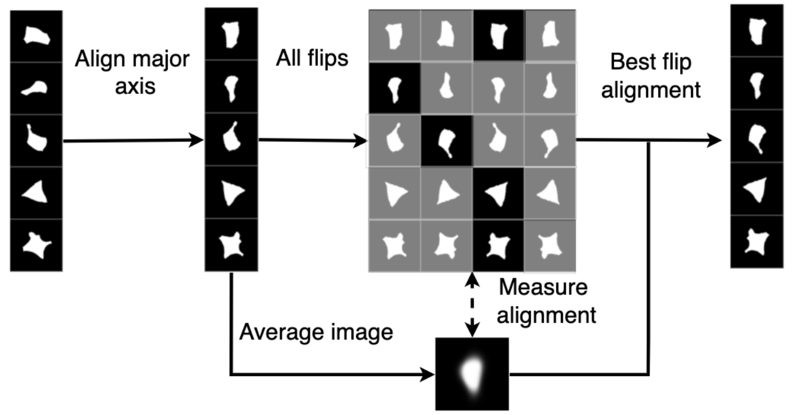

# Pre-alignment 

For very simple datasets (e.g. nuclei segmentation masks) a preprocessing method, 'prealignment', may be enough to control for orientation sensitivty. For users who want to try this approach before using O2vae, We provide some basic functions below.  
# Method
A number of existing works discuss prealignment, for example in ["Comparison of quantitative methods for cell-shape analysis"](https://onlinelibrary.wiley.com/doi/full/10.1111/j.1365-2818.2007.01799.x).

There is variation in the details, but we use the following procedure. 
- In the first stage, the 'major-axis' is computed and aligned to the y-axis. One definition of the 'major axis' is the major axis of the first order ellipse that has the same second moments as the image, which we compute using scikit-image. An alternative definition is the first primary component from a PCA, where the input data are the flattened x-y coordinates of either the image pixels or of evenly-spaced points along the shape outline. Both approaches require a segmentation to compute the angle.
- The major axis alignment only determines orientation up to flips in the x or y axis, so a second stage updates the final orientation. The approach is to register each cell against a single reference. For some cells, the objects may have a 'natural' orientation (e.g. the outline of Drosophila) which can be used as a reference. But when no orientation is known, a common choice is the mean cell over all images. For each image, we choose the flip that minimises the image cross-correlation with the mean cell. After choosing the flip for each image, the mean cell will be different, so this process is repeated iteratively until the average cross-correlation loss converges, which took fewer than 30 iterations for our datasets. 




# Implementation and usage 
We provide a reference implementation in `./prealignment.py`. Given a numpy array or torch tensor of images with shape `(n_images,n_channels,height,width)`, align the dataset by:

```
# major axis alignment
x_align_1= align.align_major_axis(x)
# flip alignment
x_align_2, in_mean_cell, out_mean_cell, err = align.align_refinement_flips(x_align_1, n_iters=20, verbose=1)
```
The final aligned dataset will be in `x_align_2`. The parameter `n_iters` controls the number of iterations. If `verbose=1`, the error at each iteration will be printed to screen. If the error has not converged, then `n_iters` should be increased, and the code rerun. 

Usage notes: 
- This requires the whole dataset fit in cpu memory (4 times). If the dataset is too big, the code will need to be refactored to work batchwise.
- This assumes the data is already a binary mask with values {0,1}.

